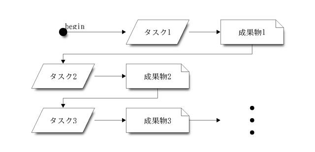
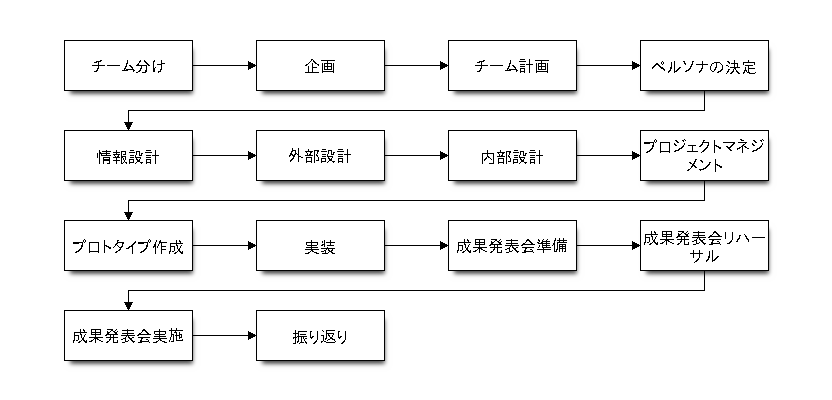
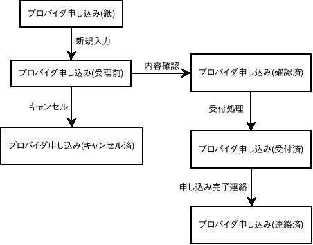
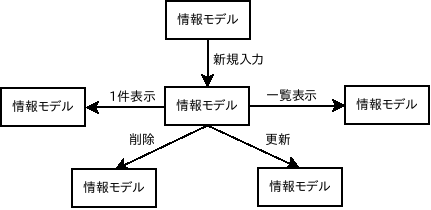
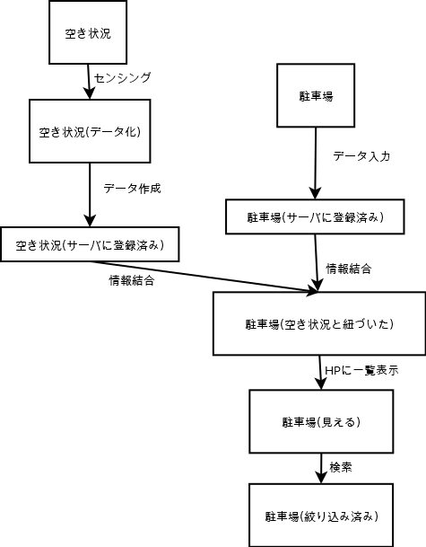

# 課題解決型学習12

# このページのURLは [https://bit.ly/3xxtE3X](https://bit.ly/3xxtE3X) です。

## 株式会社OCCの紹介

<iframe src="https://onedrive.live.com/embed?cid=269CDB82062F0E89&resid=269CDB82062F0E89%213293&authkey=APqco-anevVOfUY&em=2" width="402" height="327" frameborder="0" scrolling="no"></iframe>

## アイスブレーク

- [メイン講師紹介](https://tomo-tomo.ddns.net/profile/)
- [サブ講師紹介](https://dandydot.no-ip.biz/~dot/presen/profile/)
- [自己紹介](https://dandydot.no-ip.biz/~dot/presen/self-introduction/)
- [オープナ](https://dandydot.no-ip.biz/~dot/presen/opener/)
- [web-timer](https://web-timer-vue.herokuapp.com)

## 講義の説明

- 目的
    - 課題解決型学習を通して社会人基礎力を身につける
    - チーム開発を経験する
    - 企画を実際に形にする
    - ユーザ・お客様に製品をアピールする
- 本講義でのルール
    - 合意した内容に変更が生じる場合には事前に報告して調整する
        - 演習時間、宿題の提出日など
- 今回の講義で話すこと
    - 顧客が抱える課題を解決するための開発テーマを企画する
    - 企画を元に開発テーマに沿った情報を洗い出す
    - 洗い出した情報を整理し、設計を行う
    - 設計を元にプロトタイプ(試作品)を作成する
    - 設計・プロトタイプを元に実装を行う
- 今回の講義で話さないこと
	- オブジェクト指向分析設計
	- データベース設計
	- ユーザインタフェースデザイン
	- プロジェクトマネジメント詳細
- 心がけて欲しいこと
    - 決められた時間内に終わらせる
        - もし、時間内に終わらせる事が難しいと判断した場合には、速やかにわからない部分を聞くなどして時間内に作業を終わらせる
    - 何かを考えたり判断する場合は上記「やること」を前提にする
    - 演習における気づきを共有する
        - コミュニケーションツール を使って共有する
            - 講義の最後に コミュニケーションツール で感想や質問などを各自一言ずつ述べる
    - PDCAを小さく沢山繰り返す
        - Plan（計画）→ Do（実行）→ Check（評価）→ Action（改善）
    - インターネット上の情報を自ら活用する
        - 情報の検索
        - 方法の検索
        - よりよい方法、ツールがあれば、それを活用して良い
    - 英語の資料を読むこと
        - 高度な英語能力がなくても読むことができます
        - 騙されたと思ってやってみてください
    - タスクの関係を常に意識する
        - 前のタスクの成果物を利用しているか?
        - 飛躍がないか?
        - 漏れがないか?
        - 
        - 

## スケジュール

- [チーム計画](#team-plan)
    - 株式会社オーシーシーの紹介
    - 企画立案①：課題（ニーズ）に対応した企画立案＆チーム編成
    - 企画立案②： チーム毎の企画立案
    - 今後のスケジュール説明
        - ・ルール説明
- [情報設計(ペルソナの決定)](#persona)
    - チーム作業の必要性
    - チーム開発の必要性と手法
    - 企画立案③： チーム毎の企画立案
- [情報設計(情報定義書)](#information)
    - 設計手法
        - ・情報設計
        - ・画面設計
- [外部設計](#external-design)
	- 外部設計
- [内部設計](#internal-design)
	- 内部設計
- [プロジェクトマネジメント](#project-management)
    - 企画立案④： プロジェクトマネジメント
    - 設計の発表＆レビュー
    - プロジェクトマネジメント
        - スケジューリング手法
            - ・WBS
            - ・かんばんによるタスク管理
- [プロトタイプ作成](#prototype)
    - チーム作業
    - プロトタイプ作成
    - 実装
- [実装](#execution)
    - チームレビュー
    - 実装作業
- [成果発表会準備](#prepare-presentation)
    - 成果発表会に向けたプレゼン準備
    - プレゼン手法
- [成果発表会リハーサル](#demonstration)
    - 成果発表会リハーサル
- [成果発表会](#presentation)
    - 個人でのライトニングトークプレゼン
    - 製品の紹介
- [振り返り](#kpt)
    - 振り返り
    - 考察
    - 改善案策定
    - 成果報告
    - 講師より総評

<a name="team-plan">

## チーム計画
</a>

- チーム開発について
    - なぜチームなのか?
        - 規模が大きな作業への対応
        - 個人能力の相互補完によるチーム能力の拡大
        - 相互学習による個人能力の拡大
        - 相互補完による作業継続性の向上
        - 一人よりチームの方が楽しい!
    - 個人の視点からチームの視点へ
        - それは個人の思いか、チームの思いか?
        - チームにとっての最善は何か?
        - 何を持ってチームの合意とするか?
    - 役割分担
        - 重複なく・漏れなく役割を決める([MECE](https://ja.wikipedia.org/wiki/MECE))
        - 役割についてチームの合意を得る
    - コミュニケーション計画
        - 会議体
			- 目的
            	- 情報の共有
			- 決める事
            	- [5W1H](https://ja.wikipedia.org/wiki/5W1H)
            		- 会議の時間
            		- 会議の参加者
        - レビュー
        - 振り返り
            - [KPT](http://kuranuki.sonicgarden.jp/2013/05/kpt.html)手法の活用
- 流れ
    - 

- (演習) (20分)
    - (タスク)
    	- チーム分けを実施する
        	- チーム名を決める
    	- チームの合意形成ルールを決定する
    	- チームのコミュニケーション計画を作成する
    	- 役割分担を決定する
        	- (例) プロジェクトマネージャ、リーダ、サブリーダ、デザイン担当、開発担当、広報、営業
        	- (注意) 作業量に偏りがないように分担すること
    - (成果物)
        - 「チーム計画書」

<a name="persona">

## 情報設計(ペルソナの決定)
</a>

- [ブレインストーミング](../discussion/#Brainstorming)

- 情報設計の流れ(前半)
    1. 取り組む課題を決定する
    1. 開発テーマを決定する
        - 開発テーマ例
            - ブロック崩しゲーム
            - 連打ゲーム
            - ブロック崩しゲーム
            - クイズゲーム
            - VR、ホログラム
            - 最新技術を用いたEntertainment
                - 道の駅に訪れる子供たちに向けたエンターテイメント。ARを利用したスタンプラリー。
                - [ソースコード](https://drive.google.com/file/d/1I3WhRbveVagUacXxukvsmIYhNHMYKs9_/view?usp=sharing)
            - Community siteの作成
                - 観光客の為のコミュニケーションサイト。
                - [ソースコード](https://drive.google.com/file/d/1FNbWV_BDzpRp2BAFhRizbIne7QUG8dDD/view?usp=sharing)
    1. ペルソナを定義する
        - 誰に対して価値を提供するのかを想定し、描き出した象徴的な人物像のことを「[ペルソナ](https://ja.wikipedia.org/wiki/%E3%83%9A%E3%83%AB%E3%82%BD%E3%83%8A)」という
        - 
        - ペルソナの属性例(必要であれば1人ではなく、家族やサークルなど複数人定義する)
            - 名前
            - 年齢
            - 性別
            - 身長、体重
            - 居住地
            - 仕事
            - 生活パターン
                - 起床、通学時間、帰宅時間、就寝時間、移動方法など
            - 価値観
            - 課題
            - 家族構成
            - 恋人
            - 人間関係
            - 収入
            - 趣味や興味の対象
            - インターネットの使用状況
            - 今回開発するシステムやアプリケーションをペルソナはいつ、なぜ利用するのか?
    1. カスタマージャーニーマップを2枚(As-Is版, To-Be版)作成する
        - イラストなどを時系列に書いて顧客の心を見つめる
        	- 現在の状況(As-Is版)
        	- 顧客が満足するまでの経緯(To-Be版)
        - [カスタマージャーニーマップ](https://webtan.impress.co.jp/e/2014/03/24/16722)

- (演習)
    - (タスク)
    	- 取り組む課題を決定する
    	- 開発テーマを決定する
    	- ペルソナを定義する
    	- カスタマージャーニーマップを2枚(As-Is版, To-Be版)作成する
    - (成果物)
    	- 「取り組む課題」
    	- 「開発テーマ」
        - 「ペルソナのプロフィール」
        - 「カスタマージャーニーマップ」2枚
        	- 現在の状況(As-Is版)
        	- 顧客が満足するまでの経緯(To-Be版)
    - (サンプル)
        - 「ペルソナのプロフィール」
            - [Twitter利用者のペルソナプロフィール](persona/Twitter_Persona.html)
            - [沖縄に来る観光客のペルソナプロフィール](persona/Tourist.pdf)
            - [和泉守兼定のペルソナプロフィール](persona/Izumi.html)
        - 「カスタマージャーニーマップ」
	        - [カスタマージャーニーマップとは？作成する目的と作り方を解説します【無料テンプレートつき】](https://majisaka.site/custmer-journey-map/)
            - [マップを活用した事例](https://markezine.jp/article/detail/29298)

<a name="information">

## 情報設計(情報定義書)
</a>

- 情報設計の流れ(後半)
    1. 開発テーマで登場する情報を全て洗い出して列挙する
    1. 洗い出した情報を整理・分類する

- (演習1)
    - (タスク)
    	- 開発テーマで登場する情報を全て洗い出して列挙する
        	- 「ペルソナのプロフィール」と「カスタマージャーニーマップ」を考慮しながらブレインストーミングを行う
        	- 挙がった情報を列挙する
    	- 洗い出した情報を整理・分類する
        	- 整理
            	- 必要な情報を残し、不要な情報を捨てる
        	- 分類
            	- 情報をカテゴリ分けする
					- オープン・カードソーティング
						- あらかじめ見出しを決めて、カード(情報)がどの見出しに属するかを決める
						- 「情報が所属する見出しを定義する」
					- クローズド・カードソーティング
						- 見出しを決めず、カード(情報)をグルーピングする
						- グルーピングに名前を付けることで「見出し」を決める
						- 「見出しを定義する」
					- オープン・カードソーティング と クローズド・カードソーティング を１つにまとめる
    - (成果物)
        - 「情報定義書」
    - (サンプル)
        - [沖縄観光における情報定義書](information/Tour.pdf)
                                 

- (演習2)
    - (タスク)
		- 情報定義書を元に、情報モデルを定義する
			- 全部の見出しが情報モデルになるとは限らない
			- 情報を処理する単位を意識して情報モデルを洗い出す
			- 例:
				- 選手情報モデル
					- 属性: 名前・ポジション・年俸・身長・球団等
					- 値の例: 宮城大弥・ピッチャー・870万円・171cm・オリックス・バファローズ
				- 利用者情報モデル
					- 属性: 名前・性別・遊びたい人等
					- 値の例: 山田太郎・男性・カラオケ好き
    - (成果物)
        - 「情報モデル定義書」

<a name="external-design">

## 外部設計
</a>

- 開発プロセスの例

- 外部設計とは、要件定義の次に行われる開発工程のことです。
    - 外部設計を通して、ユーザ・お客様とチームの共通認識ができるようになる。

- 何が「外部」なのか?
	- 開発対象システムの外側とのやり取りに必要な情報を、外部設計で設計・定義していきます。

- 必要な機能と画面を洗い出す方法
    1. 「情報定義書」からカテゴリ分けした情報がどのように状態遷移するか決定する
    1. 情報を状態遷移させるのが「機能」であり「画面」になる
        - 機能とはITを使ってペルソナの要望を満たす手段
        - 情報モデルの状態遷移(LINEの例)
        - 
        - 情報モデルの状態遷移(プロバイダ申し込み情報の例)
        - 
        - 情報モデルの状態遷移(CRUD: Create Read Update Delete)
        - 
        - 情報モデルの状態遷移(駐車場と空き状況情報の例)
        - 
                         
- (演習)
    - (タスク)
    	- 必要な機能と画面を洗い出す方法
			- モデル定義書で記した状態モデルから状態遷移図を作成する
        	- 状態遷移図から必要な 画面一覧、機能一覧、画面遷移図、画面仕様書 を作成する
    - (成果物)
    	- 「情報の状態遷移図」
        	- (サンプル(誤って情報モデルと機能がごっちゃになってしまった例))
        		- [観光客向け予約システムにおける情報の状態遷移図](view/情報モデルの状態遷移図.jpg)
        	- (サンプル(誤って画面遷移図を設計してしまった例))
        		- [Twitterにおける情報の状態遷移図](view/State_Transition.jpg)
		- 「外部設計書」
			- 画面一覧
			- 機能一覧
			- 画面遷移図
			- 画面仕様書 

			- [外部設計-設計書テンプレート.xlsx](./files/外部設計-設計書テンプレート.xlsx)

<a name="internal-design">

## 内部設計
</a>

- 開発対象システムの要件や外部設計をシステム内部でどのように実現するのかを仕様として定義するのが「内部設計」です。
	- システム開発中の工程のひとつ。
	- 内部設計で要件を仕様（設計書）に変換する。
	- システムの具体的な動作を決める作業。

	- DBMSとは
		- [データベース管理システム（DBMS）の役割](https://proengineer.internous.co.jp/content/columnfeature/6411#section103)
	- DBMS を使った場合
		- DBMSはアクセスが標準化される
		- クエリを使ってデータアクセスが高速化される
	- DBMS を使わない場合
		- 設計が独自使用になる。その結果設計に依存する。

- 内部設計で行うこと  
開発案件毎に違いはあるが、DBMSを使用するとき一般的に内部設計では以下の作業を行う。
	- データベース設計
		- データベースはデータを保持する箱であり、[永続性](http://mix.kumikomi.net/index.php/%E6%B0%B8%E7%B6%9A%E6%80%A7)をもつ。きれいに整理しておくことでデータの追加、変更、削除を行う際に容易になります([正規化](https://ja.wikipedia.org/wiki/%E6%AD%A3%E8%A6%8F%E5%8C%96))
			- 正規化の手順は、第一正規化 → 第二正規化 → 第三正規化 の順です
		- 同じデータの重複を省くことによって、変更があった際に一箇所だけを修正すればよくなります
		- テーブル定義書
			- 必要なテーブル名、それに関連する属性詳細を記述する
		- ER図
			- 正規化した情報を元にテーブル関の関係性を表した図
	- CRUD図
		- [CRUD - Wikipedia](https://ja.wikipedia.org/wiki/CRUD)
		- 処理を行うために必要な項目が画面レイアウトに含まれているか?
		- 画面に表示する項目(画面仕様書)がDB項目(DB設計、ER図)に含まれているか? または計算によって表示(導出)可能か?
	- 機能設計
		- 項目の入力チェック
			- 〇〇入力画面の「名前」は必須入力？。
			- 〇〇入力画面の「日付」は未来日はＮＧ？。
		- ボタンの動作
			- 登録ボタンを押したら〇〇チェックをして、〇〇テーブルに〇〇する。
		- 初期設定
			- 〇〇登録画面の〇〇日には今日の日付を初期設定。

- 参考リンク集 
	- ドキュメント
		- [そもそもデータベースとは？基礎から分かるデータベース入門](https://proengineer.internous.co.jp/content/columnfeature/6411#section103)
		- [初めてのデータベース設計](https://gihyo.jp/dev/feature/01/database/0001)
		- [4ステップで作成する、DB論理設計の手順とチェックポイントまとめ](https://qiita.com/nishina555/items/a79ece1b54faf7240fac)
  		- [Codecademy](https://www.codecademy.com/courses/learn-sql/lessons/manipulation/exercises/sql?action=resume_content_item)
  		- [Khan Academy](https://ja.khanacademy.org/computing/hour-of-code/hour-of-sql/v/welcome-to-sql)
  		- [SQL - Progate](https://prog-8.com/languages/sql)
  		- [Introduction to SQL - SQLBolt](https://sqlbolt.com/lesson/select_queries_introduction)
  		- [MySQL入門編メニュー - bituse](https://bituse.info/mysql/)
		- [ER図とは？書き方やテクニックをわかりやすく解説](https://products.sint.co.jp/ober/blog/create-er-diagram)
		- [セブンイレブンのレシートから第三正規形を求める](https://qiita.com/riku-shiru/items/be7df6e2a02b3173438d)
	- 動画学習サイト
		- [データベースとは](https://www.youtube.com/watch?v=gGKM4dSDneA)
		- [データモデル](https://www.youtube.com/watch?v=u24MeS4Q-M0)
		- [PostgreSQLとはなにか？](https://dotinstall.com/lessons/basic_postgresql/26101)
		- [SQL入門 レッスン](https://www.youtube.com/watch?v=j4kh9YBS7QU&list=PLXOP1_-wmgsAB9S0cgM2z3DCQTFoetEVB)
  		- [SQL入門編2: SQLを仕事に使おう](https://paiza.jp/works/sql/primer/beginner-sql2)
  		- [PostgreSQL入門 - ドットインストール](https://dotinstall.com/lessons/basic_postgresql)
		- [DB/SQL入門編 (全2レッスン)](https://paiza.jp/works/sql/primer)
		- [関係データベースで起こる問題](https://www.youtube.com/watch?v=2lMn6t3D1hw&feature=youtu.be)
		- [正規化の目的](https://www.youtube.com/watch?v=nDmDKDrkwoM&feature=youtu.be)
		- [主キー](https://www.youtube.com/watch?v=7a-2PqNg-_0)
		- [第1正規形](https://www.youtube.com/watch?v=c2LdmWAslBw)
		- [第2正規形](https://www.youtube.com/watch?v=1K6EM3woxms&feature=youtu.be)
		- [第3正規形](https://www.youtube.com/watch?v=aYjxNQRQyKs)

- (演習)
    - (タスク)
		- 必要に応じて以下の4つを作成する。(DBMSを使用する場合)
			- テーブル定義書
			- ER図
				- ER図作成ツール
					- [a5m2](./software/a5m2_2.14.0_x64.zip) をクリックするとダウンロードできます。
			- CRUD図
			- 機能設計書
		- DBMSを使用しない場合
			- 正規化したデータ
				- [JSON](https://ja.wikibooks.org/wiki/JSON) フォーマット(テキストファイル)で記述することによって、配列や連想配列に変換できて容易に管理できます。
					- [JavaScriptのJSONを理解してデータを活用できるようにしよう](https://techplay.jp/column/611)
			- ファイル設計書
				- [ファイル設計書 - サンプル](https://www.kk-kano.jp/info/doc/%E8%AB%8B%E6%B1%82%EF%BD%B1%EF%BD%AF%EF%BE%8C%EF%BE%9F%EF%BE%9B%EF%BD%B0%EF%BE%84%EF%BE%9E%EF%BC%88%E7%B0%A1%E6%98%93%E7%89%88%EF%BC%89.pdf)
    - (成果物)
		- DBMSを使用するチーム
			- テーブル定義書
			- ER図
			- CRUD図
			- 機能設計書
		- DBMSを使用しないチーム
			- 正規化したデータ
			- ファイル設計書
- [内部設計書テンプレート.zip](./files/内部設計書テンプレート.zip)
- [内部設計書サンプル.zip](./files/内部設計書サンプル.zip)

<a name="project-management">

## プロジェクトマネジメント
</a>

- プロジェクトマネジメント
    - スケジューリング手法
        1. 必要なタスクを洗い出す
            - (例) [IT津梁祭りブース出展](images/IT津梁祭りブース出展.png)
        1. [WBS](./WBS-20160415/)
            - WBSツール
                - [MSProject](https://www.microsoft.com/ja-jp/project)
                - [ProjectLibre](https://ja.osdn.net/projects/sfnet_projectlibre/)
        1. かんばんによるタスク管理
            - 「かんばん」と呼ばれる方法でタスクを見える化する
            - 方法
                - WBSで洗い出した各タスクを付箋紙で書き出す
                - 模造紙に「Todo」「Doing」「Done」と三等分する線を引く
                - 付箋紙のタスクを全て「Todo」に張る
                - タスクに着手したら付箋紙を「Doing」に移動する
                - タスクが完了したら付箋紙を「Done」に移動する
            - (サンプル)
                - [Wikipedia:かんばん](https://ja.wikipedia.org/wiki/%E3%81%8B%E3%82%93%E3%81%B0%E3%82%93_\(%E3%82%BD%E3%83%95%E3%83%88%E3%82%A6%E3%82%A7%E3%82%A2%E9%96%8B%E7%99%BA\))
        1. カレーライスのタスク＆WBS、かんばんの例

        <iframe src="https://onedrive.live.com/embed?cid=269CDB82062F0E89&resid=269CDB82062F0E89%212547&authkey=AGAJ2I4nEDaxbow&em=2" width="402" height="327" frameborder="0" scrolling="no"></iframe>

- (演習)
	- (タスク)
    	- 疑似プロジェクトの「かんばん」を作成し、タスクとタスクの関係を明らかにする
    	- 以下いずれかのテーマを選択し、全てのタスクを洗い出して「かんばん」を作成する
        	- 「展示会へのブース出展プロジェクト」
        - 「宴会プロジェクト」
        - 「海外旅行プロジェクト」
    		- 決めること
        		- 担当者
        		- 所要時間
        		- 成果物
        		- タスクの終了条件
        		- (オプション)いつ開始して、いつ終了するか
        		- (オプション)後続タスク
	- (成果物)
		- かんばん(選択したプロジェクト名)

- (演習)
	- (タスク)
    	- みなさんが開発する製品について、全てのタスクを洗い出し「かんばん」を作成する
    		- 注意点
        		- 本講義資料の冒頭にある「やること」を参照し、全てのタスクを洗い出すこと
	- (成果物)
		- タスクの洗い出し
		- WBS
		- ガントチャート
		- かんばん(開発テーマ名)

<a name="prototype">

## プロトタイプ作成
</a>

- プロトタイプ作成
    - モックアップツール
        - [Atomic](https://atomic.io/)
        - [Fluid](https://www.fluidui.com/)
        - [NinjaMock](https://ninjamock.com/)
        - 紙(紙芝居)
- 環境
    - 実行環境
        - [Netlify](https://www.netlify.com/)
        - [Google Cloud Platform](https://console.cloud.google.com/?hl=ja)
- 実装
    - 開発ツール
        - [Bubble](https://bubble.io/)
            - [ノーコードでウェブアプリが作れる！Bubble（バブル）の使い方](https://blog.nocodelab.jp/entry/2019/07/24/%E3%83%8E%E3%83%BC%E3%82%B3%E3%83%BC%E3%83%89%E3%81%A7%E3%82%A6%E3%82%A7%E3%83%96%E3%82%A2%E3%83%97%E3%83%AA%E3%81%8C%E4%BD%9C%E3%82%8C%E3%82%8B%EF%BC%81Bubble%EF%BC%88%E3%83%90%E3%83%96%E3%83%AB)
        - [Monaca](https://ja.monaca.io/)
            - [Monaca Docs - サンプル&Tips](https://docs.monaca.io/ja/sampleapp/)
        - [Unity](https://unity.com/ja)
    - 機械学習モデル作成ツール
        - [Lobe](https://www.lobe.ai/)
    - 参考
        - [JavaScript DOM の説明](../JavaScript-DOM)
        - [Monacaサンプルアプリの改変例](../monaca)
        - [jQuery](http://jquery.com/)
            - [jQueryでクリックやエンター入力のイベントを処理する例](jquery)

- (演習)
    - プロトタイプ作成
        - 「画面一覧」を元に「画面遷移図」を作成する
        - モックアップツールを利用し「画面遷移図」通りに遷移するプロトタイプを作成する
        - (参考)
            - [Fluid手順書](../fluidui/_build/html/index.html)
    - 実装
        - 開発ツールを利用し製品を作成する

<a name="execution">

## 実装
</a>

- チームレビュー
- 実装

<a name="prepare-presentation">

## 成果発表会準備
</a>

- プレゼン手法
    - 手順
        1. 伝えたいことを1～3つ決める
        1. 伝えたいことを簡潔な文章(キャッチフレーズ)で書きだす
        1. 伝えるためのストーリー(プロット)を決める
        1. プレゼン資料の全体構成(アウトライン)を作成する
        1. 全体構成(アウトライン)に沿ってプレゼン資料の各ページを作成する
    - テクニック
        - ホールパート法
            - 何かを分かり易く説明するための手法
                1. まず全体像を説明する
                1. 次に、詳細を説明する
                1. 最後にまとめとして全体像をふりかえる
            - 全体-部分-全体(ホール・パート・ホール)の良い所
                - 聴者が先を予想しながら聞ける
                - 最低3回、同じことを説明できる
        - 例え話
            - 聴者にイメージを描いてもらい、効果的に話を聞いてもらうために利用します
            - 一般的な知識をベースにしたものを利用するのがコツです
            - (例)
                - 独自のデータフォーマットは例えるなら外国語のようなものです。他国(他のシステム)からは理解できません
                - Javaのクラスとは「たこ焼プレート」のようなものです。プレートを元に作られるのが「たこ焼」ですが、これがJavaではインスタンスです
        - 発問
            - 聴者自ら考えて欲しいときに、聴者に対して問題を投げかけるのが発問です
            - どんなときに発問するのか?
                - 聴者に考えてもらう
                - 聴者に参加を促す
                - 聴者の講師への依存度を下げる
                - 話し合いをはじめるきっかけを作る
                - 理解度を確かめる
            - (例)
                - みなさんゲームに対して不満はございませんか?
                - このシステムを導入することのメリットについてどう思いますか?
                - …について話して頂けませんか?
            - 注意点
                - 発問により、プレゼンが効果的になるようにする
                - 想定される回答を事前に用意し、回答に対するリアクションまで考えておく
        - 質問への対応方法
            - 質問は最後まで聞くこと
            - 発表者は質問を復唱し聴者全体が「今どういう質問が出ているのか」を理解してもらい、その後に回答する
                - (例) 今のご質問は〇〇〇ということでよろしかったですね?
        - スライド作成テクニック
            - [高橋メソッド](https://ja.wikipedia.org/wiki/%E9%AB%98%E6%A9%8B%E3%83%A1%E3%82%BD%E3%83%83%E3%83%89)
                - 短い単語や文章を大きな文字で表示する
            - [もんたメソッド](http://d.hatena.ne.jp/keyword/%A4%E2%A4%F3%A4%BF%A5%E1%A5%BD%A5%C3%A5%C9)
                - 肝心な部分を隠し、説明直前に表示する
                - (例) 「今〇〇〇が熱い!」→「今JavaScriptが熱い!」
        - 良質なスライドを参考にする
            - スライド共有サイト
                - [SlideShare](http://www.slideshare.net/)
                - [Speaker Deck](https://speakerdeck.com/)
        - プレゼン練習
            - 事前に制限時間内で伝えたいことが伝えられるよう練習する
            - 質疑応答の時間がある場合、想定される質問を事前に列挙し、その回答や回答スライドを用意しておく
            - 短い文章で言いきれているかチェックする
            - 使用するジェスチャーが効果的かチェックする
            - 板書をする場合、事前に板書する内容を書いておく(描いておく)
- ※ ブース出店がある場合に下記を実施
	- 人を引き付けるためのブース配置の検討
   		- まずは制約事項を把握する
        	- 出店マニュアルや質問を通して [成果発表会](http://www.it-matsuri.net/) の制約を把握する
        	- ブースの広さ
        	- レンタル可能な機材
        	- パネルの設置可否
        	- パネルの印刷方法
        	- ライトニングトークの発表資料の送付方法
        	- 禁止事項
    	- 大前提
        	- 以前に想定した「ペルソナ」が立ち寄りたくなるブースを考える
    	- 動線
        	- 左回りの法則
            	- 人は無意識に左回りを好み、道に迷うと左を選ぶ
            	- コンビニが典型
        	- 立ち寄りたいブース
            	- 恐くない雰囲気
                	- 専門知識がなくても話ができそうな雰囲気
                	- (もしかすると、ただチラッと見たいだけの来場者もいるかもしれない)
            	- 何か貰えそう
                	- 最新情報
                	- アイデア
                	- ノベルティ
    	- チェックポイント
        	- 遠くからでも目立つか?
        	- (ポスターなど)遠くからでも読めるか?
        	- 呼び込みはどのように行うか?
            	- 衣装は?
            	- キャッチフレーズは?
            	- どう説明・説得するか?
        	- 何か配布するか?
            	- チラシ
            	- ノベルティ
- ※ アンケートの必要がある場合に実施
	- アンケート作成
    	- チェックポイント
        	- 来場者から何を聞き取りたいか?
        	- 改善につながるアンケート結果が得られるものになっているか?
        	- 何件のアンケート回答を得たいのか?
    	- 注意点
        	- アンケート内容が誘導質問になると、実際の意見が聞けなくなってしまう
        	- 1(大変良くない) 2(良くない) 3(どちらとも言えない) 4(良い) 5(大変良い)
            	- この場合　3(どちらとも言えない)　を選びがちになる
        	- 1(大変良くない) 2(良くない) 3(良い) 4(大変良い)
            	- この場合、実際の意見が得られやすい
        	- アンケートに答えるメリットがなければ、なかなか答えてくれない
            	- (対策例) アンケート用紙をくじ引きの抽選券にする
            	- (対策例) アンケートの意図を伝え、賛同してもらう

<a name="demonstration">

## 成果発表会リハーサル
</a>

- 成果発表会リハーサル
    1. 製品の動作確認
    1. プレゼン資料(プレゼンスライド、パネル、チラシ等)の最終確認
    1. 当日役割の最終確認

<a name="presentation">

## 成果発表会
</a>

- 個人でのライトニングトークプレゼン
- 製品の紹介

<a name="kpt">

## 振り返り
</a>

- ※ アンケート集計がある際に下記を実施
    - アンケート結果を集計する
    - グラフや図を用いて、アンケート結果を見える化し、傾向やパターンを探る
        - (参考) [Excel・エクセル｜グラフの作り方・編集テクニック - Be Cool Users Office](http://www.becoolusers.com/excel/excel-graph.html)
        - (参考) [QC7つ道具](http://fk-plaza.jp/Solution/solu_qc7.htm)
    - 今回の目標値である、200件のアンケート数が達成できたかを判断する
    - 考察
      - アンケート結果から分かったことをまとめる

- 改善案策定
  - 企画・製品の課題を洗い出し、改善策を検討して KPT 形式でまとめる
      - 企画を実際に形にする事ができたか
      - ユーザ・お客様に製品をアピールすることができたか
- ペルソナのアップデート
  - 分析、KPTを通して今後どういう風に開発を進めるべきか
      - ペルソナを変える必要があるのか
      - ペルソナを変えずに元々のペルソナに沿った製品にするのか
          - そのためにはどのような工夫が必要か
- 全体のKPT
    - 全体の課題を洗い出し、改善策を検討して KPT 形式でまとめる
    - 課題解決型学習を通して社会人基礎力を身につける事ができたか
    - チーム開発を経験できたか
- (成果物)
  - 「企画・製品のKPT」 
  - 「プレゼンスライド」
  - 「製品」
  - 「これまでに提出してもらった資料で変更があった資料」
  - 「全体KPT」
- 成果発表会の感想
- 講師より総評
